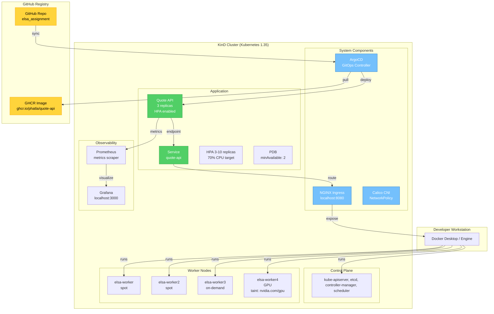
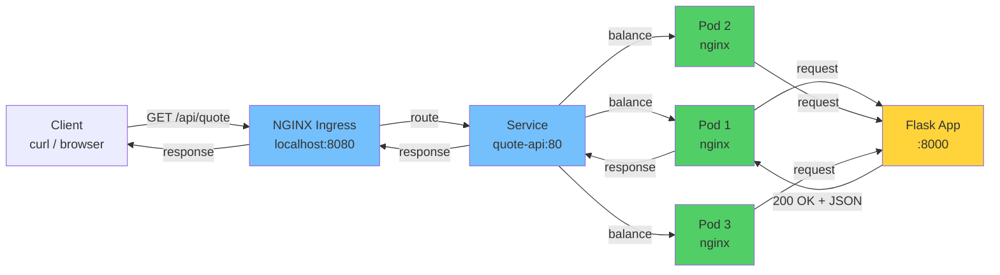
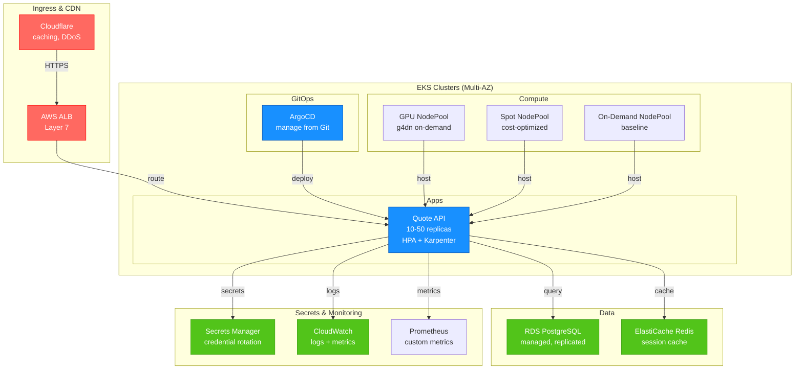

# DevOps Assignment: ELSA (Kubernetes, GitOps, Troubleshooting, CI/CD)

A self-contained, reproducible DevOps workflow demonstrating containerization, GitOps deployment, troubleshooting, CI/CD pipelines, and load testing on a local Kubernetes cluster.

**Status:** ✅ Parts 1-3 Complete | Parts 4, 6, 7 Ready  
**Repo:** https://github.com/PhaTLa/elsa_assignment  
**Image:** ghcr.io/phatla/quote-api

---

## Quick Start — The One Command

### Prerequisites
- Docker Desktop or Docker Engine
- kubectl (v1.35+)
- Bash

### Run Everything (Golden Rule)

```bash
# Clone repo
git clone https://github.com/PhaTLa/elsa_assignment.git
cd elsa_assignment

# Run all phases: build → deploy → test → troubleshoot
bash scripts/run-all.sh
```

**What it does:**
- Starts KinD cluster with 5 nodes (2 spot, 1 on-demand, 1 GPU, 1 control plane)
- Builds app image and pushes to GHCR
- Installs ArgoCD and deploys app via GitOps
- Runs reclaim drill (spot node failure test)
- Applies Part 3 troubleshooting fixes and verifies

**Expected duration:** ~5 minutes  
**Expected result:** `verify.sh → PASS`

### Quick Tests

```bash
# Test API
curl http://localhost:8000/api/quote

# Verify all checks
bash troubleshoot/verify.sh

# View ArgoCD
open http://localhost:8888  # admin / 6FjraTi5ll6TWtx2
```

---

## Architecture

### Local Development Cluster



---

## Data Flow: Request to Response



---

## Script Reference

| Script | Purpose | Part |
|--------|---------|------|
| `run-all.sh` | Orchestrate all phases (1-3 + optional) | Main |
| `10-build.sh` | Build & push app image to GHCR | 1 |
| `15-deploy-argocd.sh` | Install ArgoCD controller | 2 |
| `20-deploy.sh` | Deploy app via ArgoCD (GitOps) | 2 |
| `25-reclaim-drill.sh` | Drain spot node, verify resilience | 2 |
| `30-troubleshoot.sh` | Apply fixed manifests, run verify.sh | 3 |
| `40-validate-tf.sh` | Terraform validation | 5 |
| `50-load-test-setup.sh` | Install Prometheus + Grafana | 6 |
| `60-loadtest.sh` | Run k6 load test | 6 |

---

## Design Decisions & Trade-offs

### 1. **KinD vs k3d**
- **Chosen:** KinD
- **Why:** Production-like K8s; real CNI (Calico); NetworkPolicy enforcement
- **Trade-off:** Heavier (~2min startup vs k3d ~1min)

### 2. **Python Flask for Service**
- **Chosen:** Python 3.12 + Flask
- **Why:** Fast iteration, Prometheus client mature, clear metrics
- **Trade-off:** Go smaller, Node more familiar

### 3. **Soft Affinity (not Hard Required)**
- **Chosen:** Preferred affinity + pod anti-affinity
- **Why:** Pods reschedule when nodes vanish (production-realistic)
- **Trade-off:** May consolidate under low load

### 4. **ArgoCD for GitOps**
- **Chosen:** ArgoCD + Helm
- **Why:** GitOps best practice, separates code from operators
- **Trade-off:** Extra layer vs direct Helm apply

### 5. **Semgrep for SAST**
- **Chosen:** Semgrep (lightweight)
- **Why:** No setup overhead, GitHub Actions friendly, OWASP-focused
- **Trade-off:** Less feedback than SonarQube

### 6. **Namespace Isolation (not Multi-Cluster)**
- **Chosen:** troubleshoot namespace (local)
- **Why:** Simple testing, no infrastructure scaling
- **Trade-off:** Can't test real cross-namespace NetworkPolicy

---

## Troubleshooting

### Port Conflict (localhost:8080)

**Symptom:** `docker compose up` fails: "bind: address already in use"

**Fix:**
```bash
# Find process using port 8080
lsof -i :8080  # macOS/Linux
netstat -ano | grep 8080  # Windows

# Kill it or change docker-compose.yml port mapping
```

### Insufficient Memory

**Symptom:** Pods in Pending: "Insufficient memory"

**Fix:**
```bash
# Docker Desktop: Increase RAM
# Settings → Resources → Memory Slider → 8GB+

# Or reduce replicas in scripts/20-deploy.sh
# Change: --set replicaCount=1
```

### Image Pull Fails

**Symptom:** Pod in `ImagePullBackOff`: "failed to pull image"

**Fix:**
1. Verify image is public:  GitHub → Settings → Packages → Make public
2. Or create pull secret if private:
```bash
kubectl create secret docker-registry ghcr-login \
  --docker-server=ghcr.io \
  --docker-username=<user> \
  --docker-password=<token>
```

---

## Production Architecture (AWS)



**Key additions for production:**
- Multi-AZ redundancy
- Managed services (RDS, ElastiCache, Secrets Manager)
- Karpenter for intelligent node provisioning
- CloudWatch for centralized logging
- Auto-scaling at both pod (HPA) and node levels
- WAF + DDoS protection

---

## File Structure

```
elsa/
├── README.md                      # This file
├── TROUBLESHOOTING.md             # Part 3 diagnostics
├── AI-USAGE.md                    # AI tool transparency
│
├── app/
│   ├── src/app.py                 # Flask: /healthz, /readyz, /metrics, /api/quote
│   ├── requirements.txt           # Dependencies
│   └── Dockerfile                 # Multi-stage, non-root
│
├── helm/quote-api/
│   ├── Chart.yaml
│   ├── values.yaml
│   └── templates/
│       ├── deployment.yaml        # Affinity, probes, security context
│       ├── service.yaml
│       ├── ingress.yaml
│       ├── hpa.yaml               # 3-10 replicas at 70% CPU
│       ├── pdb.yaml               # minAvailable: 2
│       └── prometheusrule.yaml    # Alert thresholds
│
├── troubleshoot/
│   ├── broken-app.yaml            # Provided (with 8 issues)
│   ├── fixed-app.yaml             # All issues resolved
│   ├── verify.sh                  # Provided (7 checks)
│   ├── smoke-job.yaml             # Smoke test
│   └── prepare.sh / prepare.ps1   # Node labeling
│
├── scripts/
│   ├── 10-build.sh                # Build & push image
│   ├── 15-deploy-argocd.sh        # Install ArgoCD
│   ├── 20-deploy.sh               # Deploy app via ArgoCD
│   ├── 25-reclaim-drill.sh        # Test spot resilience
│   ├── 30-troubleshoot.sh         # Apply fixes + verify
│   ├── 40-validate-tf.sh          # Terraform validation
│   ├── 50-load-test-setup.sh      # Install Prometheus/Grafana
│   ├── 60-loadtest.sh             # Run k6 test
│   └── run-all.sh                 # Orchestrate all
│
├── docker-compose.yml             # KinD + toolbox
└── .github/workflows/
    └── build-and-deploy.yml       # GitHub Actions (SAST + scan)
```

---

## Part Completion Status

| Part | Task | Status |
|------|------|--------|
| 1 | Build & Ship | ✅ Complete |
| 2.1 | Helm Chart | ✅ Complete |
| 2.2 | ArgoCD | ✅ Complete |
| 2.3 | Deploy | ✅ Complete |
| 2.4 | Reclaim Drill | ✅ Complete |
| 3 | Troubleshooting | ✅ Complete |
| 4 | CI/CD Migration | 🟡 Ready (optional) |
| 6 | Load Testing | 🟡 Ready (optional) |
| 7 | Ops Questions | 🟡 Ready (optional) |

---

## Quick Verification

```bash
# Everything passes?
bash troubleshoot/verify.sh

# Expected: PASS

# See status
kubectl get all -n troubleshoot
kubectl get networkpolicies -n troubleshoot
```

---

**Last Updated:** 2026-06-19  
**License:** MIT

